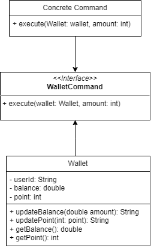

## Microservice 4 of MyMRT: Payment and Top Up

### Description
- Subtract user's balance based on ticket's price
- Top up some amount of money to user's balance
- every each command (either topup or deduct, will go to wallet's History)
- each user has 1 wallet
- Design pattern in use: (Wallet) Command Pattern
  

### API Specification
#### /api/payment/pay
``` 
Given input:
{
    amount: 12000,
    userId: 1
}

 ```
Get balance from user_id first, then check whether user’s balance is enough:
<br>- If not enough, returns false (then caught by ticket/purchase from Service 3).
<br>- If enough, subtract user balance.
<br> Note: Needs Service 1 (Authentication) and 3 (Ticket Purchase and History)

#### /api/payment/topup
``` 
Given input:
{
    amount: 12000,
    userId: 1
}
 ```
get userId from Service 1 
<br> Note: Needs Service 1 (Authentication)

ERD:

