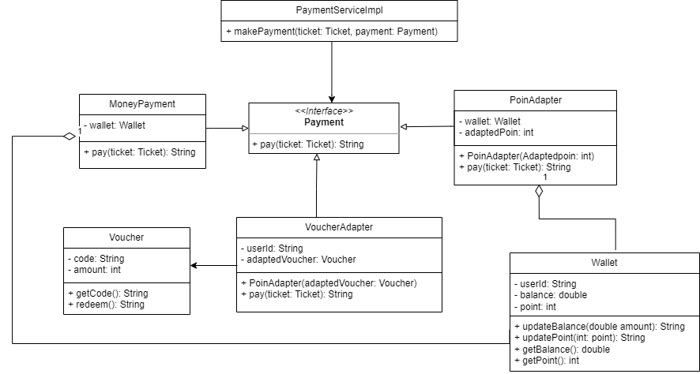

## Microservice 4 of MyMRT: Payment and Top Up

### Description
- Subtract user's balance based on ticket's price
- Top up some amount of money to user's balance
  - Rp50.000
  - Rp100.000
  - Rp150.000
  - Rp200.000
  - Rp250.000
  - Rp300.000
  - Rp350.000
  - Rp400.000
  - Rp450.000
  - Rp500.000
- Allowing user to pay ticket with coupon (TBD)
  - coupon can only be used one time
  - each coupon have minimum price (can only be used if reach certain minimum prices)
- Allowing user to pay ticket with mrtPoin (TBD)
  - User will get Poin for every payment
  - poin gained = 4 point per Rp5.000,00 (tentative)
- Design pattern in use: (payment) Adapter Pattern and (topup) Command Pattern

### API Specification
#### /api/payment/pay

``` 
Given input:
{
    amount: 12000,
    userId: 1
}

 ```
Get balance from user_id first, then check whether user’s balance is enough (optional to use coupon to pay):
<br>- If not enough, returns status 403 (caught by ticket/buy-ticket from Service 3).
<br>- If enough, subtract user balance (if not using coupon), (use account/edit-account from Service 1).
<br> Note: Needs Service 1 (Authentication) and 3 (Ticket Purchase and History)

#### /api/payment/topup

``` 
Given input:
{
    amount: 12000,
    userId: 1
}
 ```
Calls account/edit-account, edit balance from Service 1 
<br> Note: Needs Service 1 (Authentication)

ERD:

